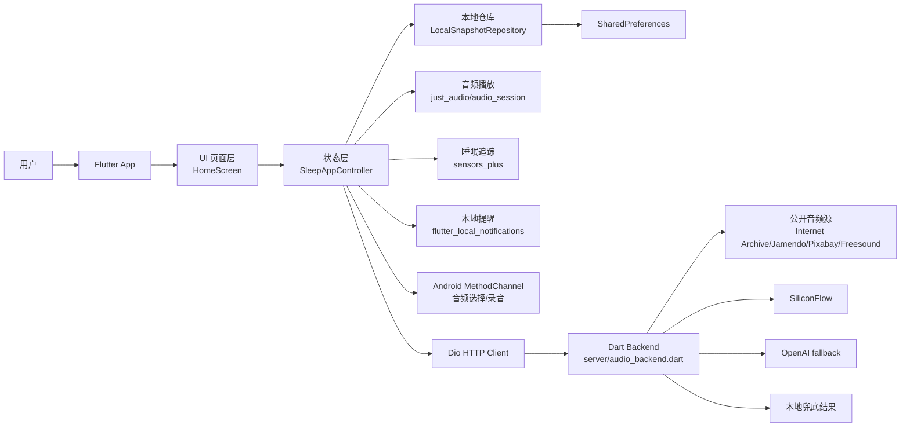
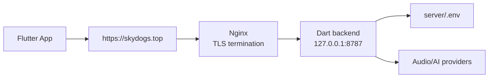

# SkyDogs 技术栈与技术方案

## 1. 项目定位

SkyDogs 是一款面向睡前场景的本地优先型睡眠与情绪陪伴 App。当前项目包含 Flutter Android 客户端、Dart 轻量后端、音频资源、Android 原生能力桥接、部署模板和基础测试。

产品核心能力包括：

- 助眠音频播放：内置自然声、冥想音频、播放队列、定时停止、循环/顺序/随机播放。
- 在线音频搜索：通过后端聚合 Internet Archive、Jamendo、Pixabay、Freesound 等免费音频源，并在客户端标准化播放。
- 情绪急救与睡前陪伴：记录夜间情绪状态，生成不发送的信、关系事件整理、睡前仪式记录。
- AI 陪伴：客户端调用自有后端，由后端优先接入 SiliconFlow，失败时可回退 OpenAI，再失败时走本地兜底文案。
- 本地数据持久化：用户偏好、播放列表、睡眠记录、关系时间线、个人场景等存储在设备本地。
- Android 原生扩展：支持本地音频选择、持久 URI 授权、麦克风录音。
- 睡眠轻量追踪：基于手机加速度计估算运动分数和休息度。

## 2. 总体架构



客户端采用单体 Flutter 架构：`main.dart` 完成初始化，`AppBootstrap` 组装服务依赖，`SleepAppController` 作为应用状态与业务编排中心，`HomeScreen` 根据状态渲染四个主要页面。服务端采用 Dart 标准库 `HttpServer` 实现轻量 API，不引入复杂 Web 框架，便于部署到云主机并由 Nginx 反向代理。

## 3. 技术栈

### 3.1 客户端

| 类型 | 技术/库 | 作用 |
| --- | --- | --- |
| 跨端框架 | Flutter / Dart SDK `>=3.9.0 <4.0.0` | Android 客户端 UI 与业务实现 |
| 状态管理 | `provider` + `ChangeNotifier` | 提供 `SleepAppController` 给 UI 消费 |
| HTTP | `dio` + `IOHttpClientAdapter` | 访问音频/AI 后端，配置超时、证书和降级地址 |
| 音频播放 | `just_audio`、`audio_session` | 播放本地 asset、文件、content URI、远程 URL |
| 本地通知 | `flutter_local_notifications`、`timezone`、`flutter_timezone` | 睡前提醒与本地时区处理 |
| 本地存储 | `shared_preferences` | 保存 `AppSnapshot` JSON 快照 |
| 文件路径 | `path_provider` | 支持离线缓存落盘 |
| 传感器 | `sensors_plus` | 加速度计睡眠轻量追踪 |
| ID 生成 | `uuid` | 睡眠会话等业务 ID |
| 图片选择 | `image_picker` | 个人场景图片导入 |
| Android 原生 | Kotlin + `MethodChannel` | 选择本地音频、录音、URI 授权 |
| 测试 | `flutter_test`、`flutter_lints` | 模型和 Widget 基础测试、静态规则 |

### 3.2 服务端

| 类型 | 技术/库 | 作用 |
| --- | --- | --- |
| 运行时 | Dart SDK `>=3.6.0 <4.0.0` | 后端服务运行环境 |
| Web 服务 | Dart `HttpServer` | 提供 HTTP API、CORS、健康检查 |
| 外部音频 | Internet Archive、Jamendo、Pixabay、Freesound | 在线音频搜索与结果归一化 |
| AI 模型 | SiliconFlow 优先，OpenAI 可选兜底 | 情绪陪伴、AI 对话、结构化建议 |
| 部署 | systemd + Nginx + Let's Encrypt | 进程守护、HTTPS 终止、反向代理 |
| 配置 | 环境变量 / `server/.env` | 保存 API Key、模型、端口等敏感配置 |

### 3.3 资源与平台

- 音频资源：`assets/audio/ambient/`、`assets/audio/meditation/`。
- 证书资源：`assets/certs/isrgrootx1.pem`，用于客户端 HTTPS 证书信任补充。
- Android 权限：`INTERNET`、`ACCESS_NETWORK_STATE`、`RECORD_AUDIO`、`POST_NOTIFICATIONS`、`SCHEDULE_EXACT_ALARM`。
- 默认后端地址：`https://skydogs.top`，可通过 `--dart-define=AUDIO_BACKEND_URL=...` 覆盖。

## 4. 客户端技术方案

### 4.1 启动与依赖装配

启动入口位于 `lib/main.dart`：

1. 调用 `WidgetsFlutterBinding.ensureInitialized()`。
2. 执行 `AppBootstrap.initialize()` 创建 Dio、Repository、音频、缓存、提醒、追踪、AI、TTS、埋点等服务。
3. 使用 `ChangeNotifierProvider` 注入 `SleepAppController`。
4. 渲染 `SkyDogsApp` 和 `HomeScreen`。

`AppBootstrap` 负责集中管理基础设施依赖，当前没有引入完整依赖注入框架，适合 MVP 阶段保持简单、可读和可调试。

### 4.2 状态管理与业务编排

`SleepAppController` 是当前客户端的核心业务层，主要职责：

- 加载和保存 `AppSnapshot`。
- 管理播放状态、播放进度、播放队列和睡眠定时器。
- 调用在线音频搜索、离线缓存、AI 辅助和 TTS 服务。
- 维护夜间情绪记录、关系时间线、个人场景、睡前仪式。
- 根据用户授权启动加速度计追踪，并生成 `SleepSession`。
- 将服务异常转换为用户可理解的状态提示。

这种集中式控制器适合当前单页多 Tab MVP；后续如果功能继续膨胀，建议按领域拆分为 `AudioController`、`EmotionController`、`TimelineController`、`ProfileController`。

### 4.3 UI 分层

当前主要 UI 位于 `lib/ui/screens/home_screen.dart`，底部导航分为：

- 心声：夜间情绪状态选择、最近记录、AI 辅助。
- 声音：当前播放、内置声音素材、在线音频搜索、播放列表、个人日记本。
- 时间线：关系事件记录，区分事实与想象。
- 我的：个人偏好、提醒、离线/隐私相关设置。

主题位于 `lib/theme/app_theme.dart`，整体为深色助眠风格。UI 使用 Flutter Material 组件和图标，未引入第三方 UI 套件，方便定制但也意味着后续需要补充组件规范。

### 4.4 数据模型

关键模型集中在 `lib/data/models/`：

- `AppSnapshot`：本地完整快照根对象。
- `MediaTrack`：音频条目，区分 soundscape 和 meditation。
- `SleepSchedule`：睡前提醒、定时器、健康同步开关。
- `SleepSession`：睡眠追踪会话、运动分数、休息度。
- `UserProfile` / `UserAccount`：用户偏好和账号占位。
- `NightEmergencyLog`：夜间情绪急救记录。
- `PersonalScene`：个人场景，包含文本、图片、音频与播放选项。
- `RelationshipEvent`：关系时间线事件，支持事实/想象区分。
- `SleepRitualLog`：睡前仪式记录。
- `AiAssistResult`：AI 生成的信件、总结和推荐音频 ID。

本地持久化采用“完整快照 JSON”方式，优点是实现简单、迁移成本低；缺点是并发写入、增量同步和大规模数据查询能力有限。当前阶段可以继续使用，云同步上线前建议引入快照版本号和迁移策略。

### 4.5 音频播放与缓存

`AudioPlaybackService` 使用 `just_audio` 统一处理四类音频来源：

- Flutter asset：内置音频。
- 本地文件路径：缓存或录音文件。
- Android `content://` URI：用户从系统文件选择器授权的音频。
- 远程 URL：在线搜索结果。

播放前由 `AudioSessionConfiguration.music()` 配置音频会话。播放结束后，控制器根据播放模式自动切换下一首。

`OfflineCacheService` 负责下载远程音频并写入本地缓存；内置 asset 天然视为离线可用。离线优先策略由 `UserProfile.offlineOnly` 控制。

### 4.6 AI 与 TTS

客户端 AI 优先走 `BackendAiAssistService`，将关系事件、当前状态、用户输入发给后端：

- `POST /api/ai/assist`：生成“不发送的信”、摘要、推荐音频。
- `POST /api/chat`：继续对话，返回自然回复。

客户端保留 `OpenAiAssistService`，但技术方案上不建议在正式版本将模型 Key 放在 App 内。生产环境应统一通过后端代理。

TTS 由 `MeditationTtsService` 抽象，当前支持：

- `DisabledMeditationTtsService`：未配置时关闭。
- `HttpMeditationTtsService`：通过 `TTS_ENDPOINT` 调用服务端代理生成音频。

### 4.7 Android 原生能力

`MainActivity.kt` 通过 `MethodChannel("skydogs/media_picker")` 提供：

- `pickAudio`：打开系统文件选择器，支持多选音频，并持久化读取授权。
- `startRecording`：申请麦克风权限并启动 AAC/M4A 录音。
- `stopRecording`：停止录音，返回文件路径、文件名、MIME 类型和时长。
- `cancelRecording`：取消录音并删除临时文件。

这部分只覆盖 Android。后续如需要 iOS 支持，需要补齐 Swift/Objective-C 侧实现与权限说明。

## 5. 服务端技术方案

### 5.1 API 设计

后端入口为 `server/audio_backend.dart`，默认监听 `8787` 端口。

| 方法 | 路径 | 说明 |
| --- | --- | --- |
| GET | `/health` / `/api/health` | 健康检查，返回 AI 和音频源配置状态 |
| GET | `/api/audio/search?q=&page=&limit=` | 聚合搜索在线音频 |
| POST | `/api/ai/assist` | 生成结构化情绪陪伴建议 |
| POST | `/api/chat` / `/api/ai/chat` | 多轮陪伴对话 |

服务端统一返回 JSON，并开启基础 CORS。未命中路径返回 `not_found`。

### 5.2 在线音频聚合

搜索流程：

1. 客户端请求 `/api/audio/search`。
2. 后端并发查询 Internet Archive、Jamendo、Pixabay、Freesound。
3. 将不同来源字段统一为 `identifier/title/creator/source/audioUrl/files`。
4. 如果全部失败或无结果，返回内置本地音频兜底结果。
5. 客户端将结果转为 `SearchResultItem` / `AudioFileItem` 并播放或加入队列。

这套设计把第三方 API Key 和结果格式差异收敛在后端，客户端只依赖稳定的内部契约。

### 5.3 AI 代理

AI 调用策略：

1. 优先读取 `SILICONFLOW_API_KEY`，按 `SILICONFLOW_MODELS` 配置顺序尝试模型。
2. SiliconFlow 不可用时尝试 `OPENAI_API_KEY` 和 `OPENAI_MODEL`。
3. 所有远程模型不可用时返回本地兜底内容。
4. `/api/ai/assist` 尽量返回结构化 JSON；解析失败时同样回退。

后端承担安全提示、JSON 约束、模型切换、错误降级和 Key 隐藏职责。客户端不直接持有模型密钥。

### 5.4 部署方案

推荐生产部署：



部署组件：

- `server/deploy/skydogs-backend.service`：systemd 进程守护。
- `server/deploy/skydogs.nginx.conf`：HTTPS 反向代理模板。
- `server/.env`：存放 `PORT`、`SILICONFLOW_API_KEY`、`OPENAI_API_KEY`、音频平台 Key 等。

建议仅开放 `80/443`，后端 `8787` 绑定内网或由防火墙限制访问。

## 6. 配置管理

### 6.1 Flutter `--dart-define`

| 变量 | 默认值 | 说明 |
| --- | --- | --- |
| `AUDIO_BACKEND_URL` | `https://skydogs.top` | 音频和 AI 后端地址 |
| `TTS_ENDPOINT` | 空 | TTS 服务端代理地址 |
| `OPENAI_API_KEY` | 空 | 客户端直连 OpenAI 预留，不建议生产使用 |
| `OPENAI_MODEL` | `gpt-4.1-mini` | 客户端直连 OpenAI 模型预留 |
| `ANALYTICS_ENDPOINT` | 空 | 行为分析端点预留 |
| `CRASH_ENDPOINT` | 空 | 崩溃上报端点预留 |
| `BACKEND_TOKEN` | 空 | 后端鉴权预留 |

### 6.2 服务端环境变量

| 变量 | 说明 |
| --- | --- |
| `PORT` | 后端监听端口，默认 `8787` |
| `SILICONFLOW_API_KEY` | SiliconFlow API Key |
| `SILICONFLOW_BASE_URL` | SiliconFlow API Base URL，默认 `https://api.siliconflow.cn/v1` |
| `SILICONFLOW_MODELS` / `SILICONFLOW_MODEL` | 模型列表或单模型 |
| `OPENAI_API_KEY` | OpenAI fallback Key |
| `OPENAI_BASE_URL` | OpenAI Base URL，默认 `https://api.openai.com/v1` |
| `OPENAI_MODEL` | OpenAI 模型，默认 `gpt-4.1-mini` |
| `JAMENDO_CLIENT_ID` | Jamendo 音频搜索 Key |
| `PIXABAY_API_KEY` | Pixabay 音频搜索 Key |
| `FREESOUND_API_KEY` | Freesound 音频搜索 Key |

## 7. 安全、隐私与合规

当前方案已体现“本地优先、云端可选”的方向，但正式上线前仍需补齐以下内容：

- API Key 不进入客户端，不提交仓库，只放在后端环境变量。
- AI 和音频请求应增加服务端限流、审计、来源校验和可选鉴权。
- 用户敏感内容默认保存在本地；若开启云同步，需要明确授权、单独开关和删除入口。
- 加速度计、通知、录音、图片/文件访问均应在用户主动触发功能时申请权限。
- Android `usesCleartextTraffic="true"` 当前便于调试，生产版建议收紧到网络安全配置白名单或彻底关闭明文。
- 情绪陪伴内容不做医疗诊断，不鼓励伤害、报复、冲动联系等高风险行为。
- 应补充隐私政策、用户协议、第三方 SDK 清单、个人信息收集清单、权限说明。
- 在线音频源需检查版权、商用、缓存、再分发和署名要求；正式内容建议优先使用自有授权资源。

## 8. 测试与质量保障

当前已有：

- `test/skydogs_models_test.dart`：模型序列化、标签、时长、离线可用性等基础测试。
- `test/widget_test.dart`：基础 Widget 测试。
- `analysis_options.yaml` + `flutter_lints`：静态规则。

建议补充：

- `SleepAppController` 单元测试：播放队列、睡眠定时器、AI fallback、离线模式。
- `ArchiveAudioService` 契约测试：后端返回不同来源字段时的兼容解析。
- `BackendAiAssistService` 错误重试测试：HTTPS、IP、HTTP fallback 顺序。
- 后端 API 测试：`/health`、音频搜索空查询、AI 解析失败、模型不可用 fallback。
- Android 原生桥接手测清单：音频多选、录音权限拒绝、录音取消、content URI 持久授权。
- 发布前真机测试：弱网、锁屏播放、后台恢复、通知权限、低电量模式。

## 9. 版本演进建议

### MVP 稳定版

- 修复现有中文资源/源码文本的编码问题。
- 完善音频播放、在线搜索、AI 对话和本地快照的核心路径。
- 收紧 Android 网络明文配置。
- 补齐隐私政策和权限弹窗说明。
- 提供可替换的正式音频资源和版权说明。

### V1.1

- 拆分控制器，降低 `SleepAppController` 体积。
- 增加云同步接口和账号体系。
- 增加后端鉴权、限流、日志和监控。
- 增加 TTS 生成任务、音频缓存管理和失败重试。
- 加入崩溃上报与基础行为分析。

### V1.2

- 接入 Health Kit / Health Connect / 华为健康能力。
- 生成睡眠周报和个性化音频推荐。
- 支持会员内容、内容运营后台和灰度发布。
- 支持 iOS 原生音频选择、录音和健康数据读取。

## 10. 运行与验证

客户端本地运行：

```powershell
flutter pub get
flutter run
```

指定本地后端：

```powershell
flutter run --dart-define=AUDIO_BACKEND_URL=http://10.0.2.2:8787
```

启动后端：

```powershell
dart run server/audio_backend.dart
```

健康检查：

```powershell
curl https://skydogs.top/health
curl "https://skydogs.top/api/audio/search?q=rain&page=1&limit=3"
```

测试：

```powershell
flutter test
```

## 11. 结论

当前项目已经具备可演示的完整 MVP 骨架：Flutter 客户端负责本地体验、播放与状态管理，Dart 后端负责外部音频与 AI 能力聚合，Android 原生层补足文件和录音能力。后续重点不在“换技术栈”，而在三件事：修复编码和内容资源质量、补齐安全合规与部署治理、按领域拆分逐渐膨胀的控制器。这样可以在保持迭代速度的同时，为云同步、会员内容和健康数据接入留出清晰扩展空间。
